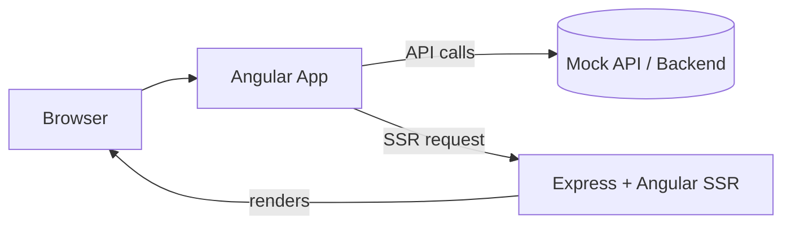

# MoviesApp
# MoviesApp

This repository contains the **MoviesApp**, a web application built with Angular.
This project was generated using [Angular CLI](https://github.com/angular/angular-cli) version 21.1.1.

## Project Structure

The project is organized as follows:

- **movies-app/**: Contains the Angular application source code.
  - `src/`: Application source files.
  - `public/`: Static assets.
  - `.vscode/`: Visual Studio Code workspace configuration files.
  - `package.json`: Project dependencies and scripts.
  - `angular.json`: Angular CLI configuration.

## Getting Started

### Prerequisites

Ensure you have the following installed:

- [Node.js](https://nodejs.org/) (v16 or higher)
- [Angular CLI](https://angular.dev/tools/cli) (v21.1.1)

### Setup

1. Clone the repository:
## Development server

To start a local development server, run:

- **movies-app/**: Contains the Angular application source code.
  - `src/`: Application source files.
  - `public/`: Static assets.
  - `.vscode/`: Visual Studio Code workspace configuration files.
  - `package.json`: Project dependencies and scripts.
  - `angular.json`: Angular CLI configuration.
```bash
ng serve
```

Once the server is running, open your browser and navigate to `http://localhost:4200/`. The application will automatically reload whenever you modify any of the source files.

## Code scaffolding

Angular CLI includes powerful code scaffolding tools. To generate a new component, run:

```bash
ng generate component component-name
```

For a complete list of available schematics (such as `components`, `directives`, or `pipes`), run:

```bash
ng generate --help
```

   ```bash
   git clone https://github.com/your-repo/MoviesApp.git
   ```

To build the project run:

   ```bash
   cd MoviesApp/movies-app
   ```

To execute unit tests with the [Vitest](https://vitest.dev/) test runner, use the following command:

```bash
ng test
```

## Running end-to-end tests

For end-to-end (e2e) testing, run:

```bash
ng e2e
```

Angular CLI does not come with an end-to-end testing framework by default. You can choose one that suits your needs.

## Additional Resources

For more information on using the Angular CLI, including detailed command references, visit the [Angular CLI Overview and Command Reference](https://angular.dev/tools/cli) page.

## Setup

Prerequisites:
- Node.js (recommended LTS 18+)
- npm (comes with Node)

Install dependencies for development (run from the repo root):

```bash
# install deps for the Angular app
cd movies-app
npm install
# or, if you prefer a clean install using the lockfile when it is in sync:
# npm ci
```

Notes:
- If `npm ci` fails with a lockfile mismatch, run `npm install` to update the lockfile, then commit the updated lockfile if appropriate.
- Many commands in this README assume you are in the `movies-app/` directory.

## Overview — recent changes

- Repository now targets the consolidated application name `movies-app` (client + optional SSR).
- A small mock API is included under `movies-app/mockoon/` with a Node fallback at `movies-app/scripts/mock-server.js` for local development.

## Architecture (high level)

The application is a single Angular app with optional server-side rendering (SSR) powered by Express.

- Client entry: `movies-app/src/main.ts`
- Server entry: `movies-app/src/main.server.ts` and `movies-app/server.ts`
- Routes are split for client/server: `movies-app/src/app/app.routes.ts` and `movies-app/src/app/app.routes.server.ts`
- Domain models: `movies-app/src/app/models/`

Simple architecture diagram (conceptual):



For a full diagram see `docs/moviesapp-diagram.mmd`.

## Main flows & code snippets

Example: service method that fetches all movies and returns an Observable (pattern used in `movies-app/src/app/services/movie-service.ts`):

```ts
// movies-app/src/app/services/movie-service.ts (excerpt)
import { HttpClient } from '@angular/common/http';
import { Injectable } from '@angular/core';
import { Observable } from 'rxjs';
import { Movie } from '../models/movie';

@Injectable({ providedIn: 'root' })
export class MovieService {
	private base = 'http://localhost:3001'; // dev mock API base
	constructor(private http: HttpClient) {}

	getAllMovies(): Observable<Movie[]> {
		return this.http.get<Movie[]>(`${this.base}/movies`);
	}
}
```

Example: using the service in a component with the `async` pipe:

```html
<!-- movies-app/src/app/app.html (excerpt) -->
<ul>
	<li *ngFor="let movie of movies$ | async">{{ movie.title }}</li>
</ul>
```

```ts
// movies-app/src/app/app.ts (excerpt)
movies$ = this.movieService.getAllMovies();
```

## Mock API

- Included environment: `movies-app/mockoon/movie-api.json` (importable into Mockoon GUI).
- Node fallback server: `movies-app/scripts/mock-server.js` (run with `node movies-app/scripts/mock-server.js`).
- NPM script (when using Mockoon CLI): `npm run mock-api` (starts mock on port 3001).

## Developer checklist

- Clone and install:

```bash
git clone <repo-url>
cd movies-app
npm ci
```

- Start mock API (optional):

```bash
# Node fallback
node scripts/mock-server.js

# or, if using Mockoon CLI
npm run mock-api
```

- Run dev server:

```bash
npm start
```

- Run tests:

```bash
npm test
```

- Before creating a PR:
	- Run `npm test` and fix failing tests.
	- Keep changes small and focused; update or add unit tests for behavior changes.
	- Format code per Prettier settings in `movies-app/package.json`.
	- Do not commit secrets; use environment variables for credentials.

## Useful links

- App entry: `movies-app/src/main.ts`
- Server: `movies-app/server.ts`, `movies-app/src/main.server.ts`
- Movie model: `movies-app/src/app/models/movie.ts`
- Movie service: `movies-app/src/app/services/movie-service.ts`
- Mockoon env: `movies-app/mockoon/movie-api.json`
- Agent guidance: `.github/copilot-instructions.md`, `.github/MOCKOON.md`

If you'd like, I can generate a markdown-rendered architecture diagram file or add CI steps to start the mock server during tests.
