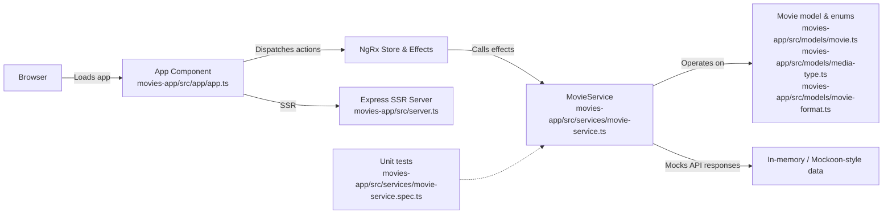

# MoviesApp

This repository contains the **MoviesApp**, a web application built with Angular.

## Architecture Diagram

The following Mermaid diagram shows the high-level components and interactions in MoviesApp.



## Overview

A simple Angular 21 frontend for managing a personal movie collection. Contains a mocked MovieService and unit tests.

Quick start:

```sh
cd movies-app
npm install
npm start      # dev server at http://localhost:4200
npm test       # run unit tests
npm run build  # production build
```

## Project layout and part descriptions

- **`movies-app/src/app`**: Application shell, routing and top-level components. Contains the bootstrapping code and page components. Pages should be implemented as standalone Angular components and use Signals for local UI state.

- **`movies-app/src/app/app.routes.ts` & `app.routes.server.ts`**: Client and server route definitions for the application. They wire pages to routes and are used by the server-side entry.

- **`movies-app/src/app/app.config.ts` & `app.config.server.ts`**: Central app configuration used on client and server side (e.g., initial data, feature flags).

- **`movies-app/src/models`**: Domain models for the app:
	- [`movies-app/src/models/movie.ts`](movies-app/src/models/movie.ts): `Movie` interface describing the movie record shape (Title, Id, Description, Genre, Criterion, CriterionNumber, MovieMediaType, MovieFormat, Year, Favourite).
	- [`movies-app/src/models/media-type.ts`](movies-app/src/models/media-type.ts): `MediaType` enum (BluRay, UltraHd, Dvd, etc.).
	- [`movies-app/src/models/movie-format.ts`](movies-app/src/models/movie-format.ts): `MovieFormat` enum (Movie, TVSeries, BoxSet, etc.).

- **`movies-app/src/services`**: Client-side services that act as the API layer (mocked):
	- [`movies-app/src/services/movie-service.ts`](movies-app/src/services/movie-service.ts): `MovieService` — in-memory API implementing add, get, getAll (with paging), getFavourite, query, update (put), changeCriterion (patch), changeFavourite (patch), remove (delete). Returns RxJS `Observable`s and simulates response delays for testing.
	- [`movies-app/src/services/movie-watchlist-service.ts`] (optional): service to manage a user's watch list (add/remove/get). (If absent, the pattern in `movie-service.ts` should be followed.)
	- Tests live in `movies-app/src/services/movie-service.spec.ts` and demonstrate usage of the service.

- **`movies-app/src/app/components` (or component files under `src/app`)**: UI building blocks. Key components planned:
	- Movies List Component: Query bar, paging support, and list rendering using the `Movie` model.
	- Movie Watch List Component: Shows movies in the user's watch list and supports add/remove.
	- Movie Header Component: Shows the app title, number of movies, and a global search bar.

- **`movies-app/src/main.ts` & `movies-app/src/main.server.ts`**: Client and server entry points for bootstrapping the Angular app.

- **`movies-app/server.ts`**: Lightweight Express server used for SSR, local mocks, or serving built assets during development.

- **`movies-app/public`**: Static assets such as icons, robots.txt, or other public files served from root.

- **`movies-app/src/styles.scss`**: Global styles for the app.

## Architecture & Conventions

- State management: Use NgRx for application state (store, reducers, selectors) and NgRx Effects to call `MovieService` for side effects (HTTP / mock API calls).
- Components: All components should be standalone, use Angular Signals for internal state, and obtain data from the NgRx store via selectors.
- Services: Services return RxJS `Observable`s and are pure wrappers around the mocked in-memory data for now — suitable for swapping with a real HTTP backend later.

## Tests

- Unit tests for `MovieService` are in [`movies-app/src/services/movie-service.spec.ts`](movies-app/src/services/movie-service.spec.ts). The test suite covers CRUD, paging, query and patch operations.

## Next steps / Suggestions

- Implement NgRx store slices for movies and watch list, and wire the effects to call `MovieService`.
- Scaffold standalone Signal-based components for the UI parts listed above and connect them to the store.
- Optionally replace the in-memory service with a real API backed by MongoDB and SQLAlchemy-based backend, as noted in the project document.

## References

- Project brief: [MoviesApp Project.md](../MoviesApp%20Project.md)
- Service implementation: [`movies-app/src/services/movie-service.ts`](movies-app/src/services/movie-service.ts)
- Tests: [`movies-app/src/services/movie-service.spec.ts`](movies-app/src/services/movie-service.spec.ts)
# MovieCollectionApp

This project was generated using [Angular CLI](https://github.com/angular/angular-cli) version 21.1.1.

## Development server

To start a local development server, run:

```bash
ng serve
```

Once the server is running, open your browser and navigate to `http://localhost:4200/`. The application will automatically reload whenever you modify any of the source files.

## Code scaffolding

Angular CLI includes powerful code scaffolding tools. To generate a new component, run:

```bash
ng generate component component-name
```

For a complete list of available schematics (such as `components`, `directives`, or `pipes`), run:

```bash
ng generate --help
```

## Building

To build the project run:

```bash
ng build
```

This will compile your project and store the build artifacts in the `dist/` directory. By default, the production build optimizes your application for performance and speed.

## Running unit tests

To execute unit tests with the [Vitest](https://vitest.dev/) test runner, use the following command:

```bash
ng test
```

## Running end-to-end tests

For end-to-end (e2e) testing, run:

```bash
ng e2e
```

Angular CLI does not come with an end-to-end testing framework by default. You can choose one that suits your needs.

## Additional Resources

For more information on using the Angular CLI, including detailed command references, visit the [Angular CLI Overview and Command Reference](https://angular.dev/tools/cli) page.
